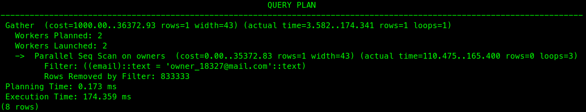

# vetclinic-performance

> Assignment to test the performance of a database. 

explain analyze SELECT COUNT(*) FROM visits where animal_id = 4;

explain analyze SELECT * FROM visits where vet_id = 2;

explain analyze SELECT * FROM owners where email = 'owner_18327@mail.com';

## Built With

- SQL
- Postgres 12
- VSCode
- Ubuntu 20.04.3

## Setup

- Get the link of the repository: `git@github.com:arthurborgesdev/vetclinic-performance.git`
- Clone it as `git@github.com:arthurborgesdev/vetclinic-performance.git` on a Terminal
- Change directory to it by `cd vetclinic-performance`
- Change branch/create local branch to/of `performance-audit` and do a `git pull origin performance-audit`
- Inspect the results (as a code reviewer from this README)

## Author

👤 **Arthur Borges**

- GitHub: [@arthuborgesdev](https://github.com/arthurborgesdev)
- Twitter: [@arthurmoises](https://twitter.com/arthurmoises)
- LinkedIn: [Arthur Borges](https://linkedin.com/in/arthurmoises)

## 🤝 Contributing

Contributions, issues, and feature requests are welcome!

## Show your support

Give a ⭐️ if you like this project!

## Acknowledgments

- Microverse
- Lessons about database indexes
- Friends!
- Lots and lots of Stack Overflow questions and answers
